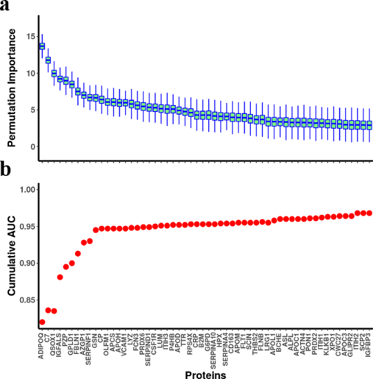

# Rheumatic Heart Disease (RHD)

Scripts to accompany the paper [**"Data independent acquisition mass spectrometry in severe Rheumatic Heart Disease (RHD) identifies a proteomic signature showing ongoing inflammation and effectively classifying RHD cases"**](https://github.com/jyangUK/Rheumatic_heart_disease/blob/master/RHD_270921.R1.docx) authored by <i>M Taariq Salie, Jing Yang,  Carlos R Ramírez Medina, Liesl J Zühlke , Chishala Chishala, Mpiko Ntsekhe, Bernard Gitura, Steve Ogendo, Emmy Okello, Peter Lwabi, John Musuku, Agnes Mtaja, Christopher Hugo-Hamman, Ahmed El-Sayed, Albertino Damasceno, Ana Mocumbi, Fidelia Bode-Thomas, Christopher Yilgwan, Ganiyu Amusa, Esin Nkereuwem, Gasnat Shaboodien, Rachael Da Silva, David Lee, Simon Frain, Nophar Geifman, Anthony D Whetton, Bernard Keavney and  Mark E Enge &  the RHDGen Network Consortium</i>. Scripts are based on R and presented in Jupyter notebook. 
 
 

- [**Get_foldchange.ipynb**](https://github.com/jyangUK/Rheumatic_heart_disease/blob/master/Get_foldchange.ipynb): calculate log2 fold-change of protein expression between cases and controls, generate corresponding p-values by t-test .
- [**Generate_Boruta_results.ipynb**](https://github.com/jyangUK/Rheumatic_heart_disease/blob/master/Generate_Boruta_results.ipynb): Use Boruta algorithm(https://www.jstatsoft.org/article/view/v036i11) to find out biomarkers for RHD.
- [**Calculate_AUC.ipynb**](https://github.com/jyangUK/Rheumatic_heart_disease/blob/master/Calculate_AUC.ipynb): Calculate Area Under Curve (AUC) for single and accummulated proteins as shown in Table 2 and Fig1b in the paper.
- [**LASSO_vs_boruta.ipynb**](https://github.com/jyangUK/Rheumatic_heart_disease/blob/master/LASSO_vs_boruta.ipynb): Compare the prediction performance of LASSO claffication and Boruta algorithm.
